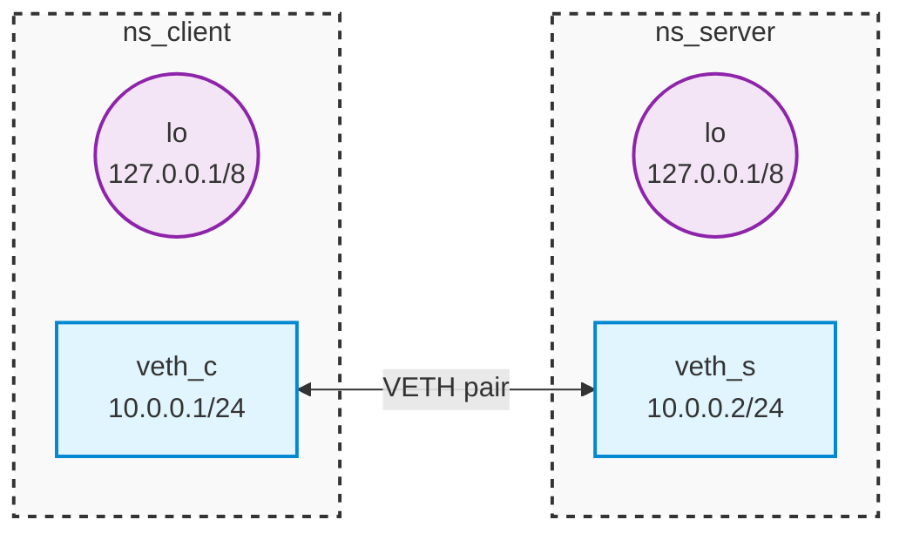

[View on GitHub]()

### Network interfaces

See what network interfaces you have:

```shell
ip address
ip a
```

Example output:

```text
[...]
2: wlp0s20f3: <BROADCAST,MULTICAST,UP,LOWER_UP> mtu 1500 qdisc noqueue state UP group default qlen 1000
    link/ether dc:21:5c:08:bf:83 brd ff:ff:ff:ff:ff:ff
    inet 192.168.178.28/24 brd 192.168.178.255 scope global dynamic noprefixroute wlp0s20f3
       valid_lft 863466sec preferred_lft 863466sec
    inet6 fe80::2ecb:209a:b7d2:bd77/64 scope link noprefixroute 
       valid_lft forever preferred_lft forever
[...]
```

Interface `wlp0s20f3` has MAC address `dc:21:5c:08:bf:83` and IP addresses `192.168.178.28` and `fe80::2ecb:209a:b7d2:bd77` assigned.

### Virtual network setup

Create isolated virtual hosts with separate networking environment:

```shell
sudo ip netns del ns_client; sudo ip netns del ns_server
```

```shell
sudo ip netns add ns_client; sudo ip netns add ns_server; ip netns ls
```

Create virtual link - pair of interfaces:

```shell
sudo ip link add veth_c type veth peer name veth_s; ip a
```

Move new interfaces into virtual hosts:

```shell
sudo ip link set veth_c netns ns_client
```

```shell
sudo ip link set veth_s netns ns_server
```

Note interfaces disappeared from regular host `ip a`.

`ip netns exec` runs any command within isolated networking environment.
Use it to list interfaces and addresses within virtual hosts.

```shell
sudo ip netns exec ns_client ip a
```

```shell
sudo ip netns exec ns_server ip a
```

Enable all interfaces (UP) and assign addresses:

```shell
sudo ip netns exec ns_client ip addr add 10.0.0.1/24 dev veth_c
```
```shell
sudo ip netns exec ns_server ip addr add 10.0.0.2/24 dev veth_s
```
```shell
sudo ip netns exec ns_client ip link set veth_c up
```
```shell
sudo ip netns exec ns_server ip link set veth_s up
```
```shell
sudo ip netns exec ns_client ip link set lo up
```
```shell
sudo ip netns exec ns_server ip link set lo up
```

Re-verify:

```shell
sudo ip netns exec ns_client ip a
```

```shell
sudo ip netns exec ns_server ip a
```

This is what we've constructed within a single operating system thanks to Linux powerful network virtualization features.



Note that regular host networking is kept completely separate.

### Netcat

Use `nc` to connect somewhere and send some data.

```shell
nc mini.pw.edu.pl 80 
```

We can even send some real request:

```shell
echo -e "GET / HTTP/1.1\r\nHost: mini.pw.edu.pl\r\n\r\n" | nc mini.pw.edu.pl 80
```

Now let's establish both sides in our virtual environment:

```shell
sudo ip netns exec ns_server nc -l -p 80 -v
```

```shell
sudo ip netns exec ns_client nc 10.0.0.2 80 -v
```

Close client connection with `C-c`.

### Packet sniffing

Run packet sniffer on server side:

```shell
sudo ip netns exec ns_server tcpdump -i veth_s -n -w dump.pcap --print
```

```shell
sudo ip netns exec ns_server nc -l -p 80
```

```shell
sudo ip netns exec ns_client nc 10.0.0.2 80
```

Try dumping host communication:

```shell
sudo tcpdump -i $(ip route get 8.8.8.8 | grep -oP 'dev \K\S+') -n -w dump.pcap --print && \
wireshark dump.pcap
```

Here `ip route get` is used to get name of the interface handling internet traffic.

```shell
echo -ne "GET / HTTP/1.1\r\nHost: mini.pw.edu.pl\r\n\r\n" | nc mini.pw.edu.pl 80
```

Look into the dump in wireshark. Try filtering by `http`/`tcp` protocol to find our request.

Find and display first frame of the request in `tshark` CLI:

```shell
STREAM_ID=$(tshark -r dump.pcap -Y "http.request.method == GET" -T fields -e tcp.stream | head -n 1)
FRAME_NUM=$(tshark -r dump.pcap -Y "tcp.stream == $STREAM_ID" -T fields -e frame.number | head -n 1)
tshark -r dump.pcap -Y "frame.number == $FRAME_NUM" -x
```

Note `tshark` options used:
* `-Y` filters frames
* `http.request.method == GET` filter used to get ID of the first TCP connection stream associated with HTTP request
* `tcp.stream == $STREAM_ID` filter is used to get the first frame index of the request
* `-x` displays frame in hex
